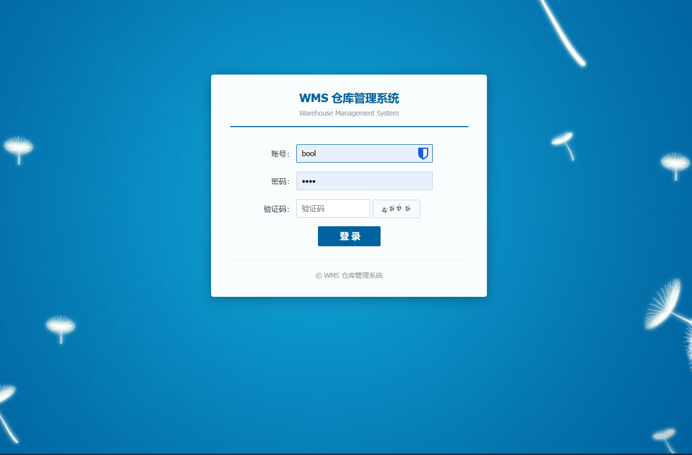
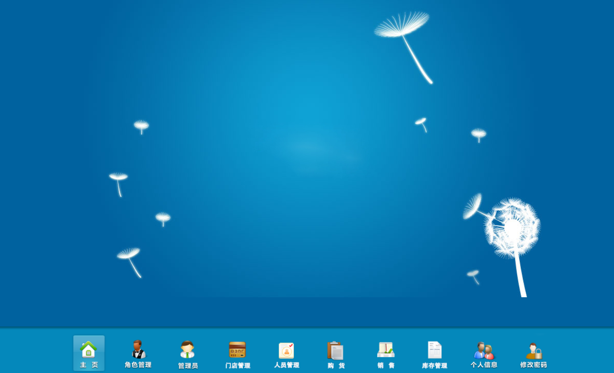
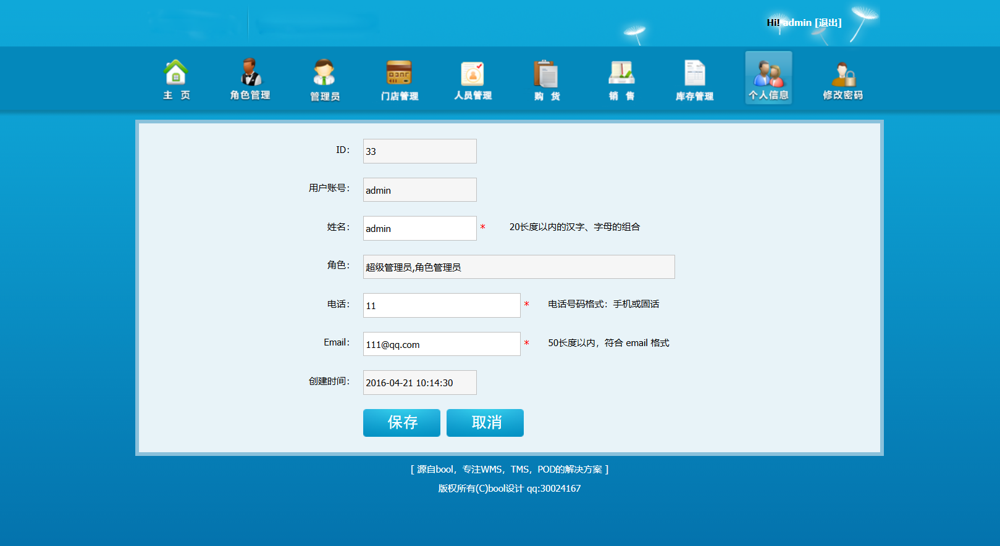
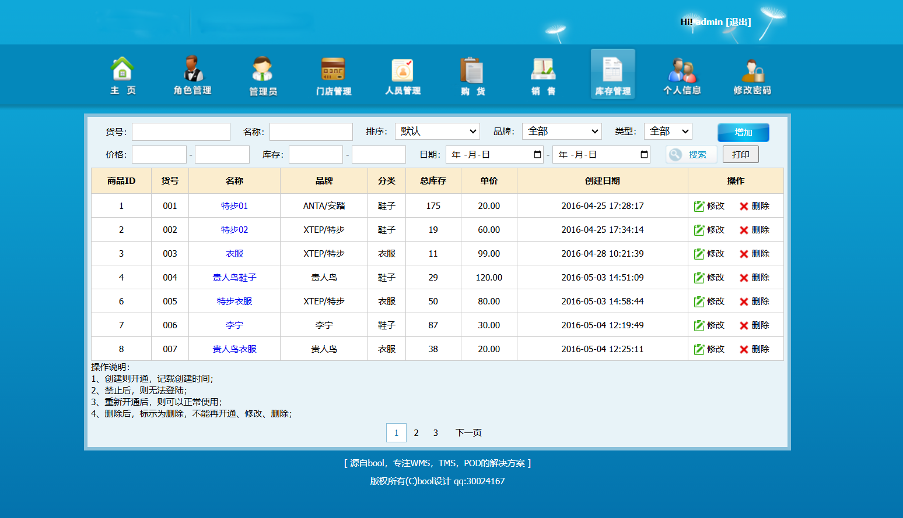

# WMS 仓库管理系统

## 项目简介

WMS (Warehouse Management System) 仓库管理系统是一个基于 ThinkPHP 3.2 框架开发的进销存管理系统。本系统适用于中小型企业的库存管理、采购管理、销售管理等场景，提供完善的权限控制和数据管理功能。

## 技术栈

| 类别    | 技术                                    |
| ----- | ------------------------------------- |
| 后端框架  | ThinkPHP 3.2                          |
| 前端    | HTML5, CSS3, JavaScript, jQuery, AJAX |
| 数据库   | MySQL 5.6+                            |
| 缓存    | Memcache (可选)                         |
| PHP版本 | 5.3+ (不支持8.0+)                        |
| Excel | PHPExcel                              |

## 主要功能模块

| 模块   | 功能               |
| ---- | ---------------- |
| 系统管理 | 角色管理、权限管理、管理员管理  |
| 基础数据 | 门店、分类、品牌、属性、职位管理 |
| 商品管理 | 商品列表、添加编辑、库存管理   |
| 采购管理 | 购货单、采购记录、入库管理    |
| 销售管理 | 销售单、销售记录、出库管理    |
| 账务管理 | 账目记录、账目明细        |
| 个人中心 | 个人信息、密码修改        |


## 界面演示

|                 登录界面                |               首页仪表盘               |                 商品管理                |
| :---------------------------------: | :-------------------------------: | :---------------------------------: |
|  |  |  |

|                 采购管理                | 销售管理 |
| :---------------------------------: | :--: |
|  |   -  |

## 安装部署

> 💡 **推荐使用图形化安装程序**，简单快捷，点点鼠标即可完成安装。

### 环境要求

| 组件         | 版本要求                      | 说明                    |
| ---------- | ------------------------- | --------------------- |
| **PHP**    | 5.3.0 - 7.4.x             | ⚠️ 不支持 PHP 8.0+       |
| **MySQL**  | 5.6 / 5.7                 | ⚠️ **不支持 MySQL 8.0+** |

> ⚠️ **重要兼容性提示**：本项目基于 ThinkPHP 3.2，**不支持 MySQL 8.0+**，建议使用 **MySQL 5.6 或 5.7**

### 安装步骤

#### ⭐ 方式一：图形化安装（推荐）

1. **上传代码** → 将项目文件上传到网站根目录
2. **设置权限** → 确保 `Application/Runtime` 和 `Public/uploads` 目录可写
3. **运行安装** → 浏览器访问 `http://您的域名/install.php`
4. **完成安装** → 填写数据库信息，点击安装 → 删除 `install.php`

### 常见问题排查

| 问题          | 可能原因           | 解决方案                      |
| ----------- | -------------- | ------------------------- |
| **连接数据库失败** | MySQL 8.0+ 不兼容 | 降级到 MySQL 5.6/5.7         |
| **字符集错误**   | 数据库字符集设置错误     | 确保使用 utf8 字符集             |
| **500 错误**  | 目录权限不足         | 设置 Runtime 目录 777 权限      |
| **404 错误**  | URL 重写未启用      | 配置 Apache/Nginx 重写规则      |
| **验证码不显示**  | GD 扩展未安装       | 安装 php-gd 扩展              |
| **页面空白**    | 调试模式未开启        | 设置 `SHOW_PAGE_TRACE => 1` |

## 测试账号

| 账号    | 密码    | 角色    |
| ----- | ----- | ----- |
| bool  | bool  | 超级管理员 |
| admin | bool | 管理员   |

## 项目结构

```
wms2016.cn/
├── Application/
│   ├── Common/Conf/     # 公共配置
│   ├── Home/            # 业务模块
│   │   ├── Controller/  # 控制器
│   │   ├── Model/       # 模型
│   │   └── View/        # 视图
│   └── Runtime/         # 运行时
├── Public/
│   ├── images/          # 图片
│   ├── js/              # JS
│   └── layer/           # 弹窗组件
├── ThinkPHP/            # 框架
├── index.php            # 入口
└── wms.sql              # 数据库
```

## 数据库表结构

| 表名             | 说明  |
| -------------- | --- |
| wms\_admin     | 管理员 |
| wms\_role      | 角色  |
| wms\_privilege | 权限  |
| wms\_goods     | 商品  |
| wms\_category  | 分类  |
| wms\_brand     | 品牌  |
| wms\_store     | 门店  |
| wms\_buy       | 采购  |
| wms\_sell      | 销售  |
| wms\_account   | 账务  |

## 核心功能路由

| 模块 | 列表                    | 添加                 |
| -- | --------------------- | ------------------ |
| 分类 | /Category/index.html  | /Category/add.html |
| 属性 | /Attribute/index.html | /Attribute/add     |
| 商品 | /Goods/index.html     | /Goods/add.html    |
| 采购 | /Buy/index.html       | /Buy/add.html      |
| 销售 | /Sell/index.html      | -                  |

## 安全建议

| 检查项 | 操作 |
|--------|------|
| 关闭调试 | `APP_DEBUG => false` |
| 删除安装文件 | `rm install.php` |
| 修改密码 | 修改默认账号 bool/bool |

## 调试与缓存

| 项目 | 配置 |
|------|------|
| 调试模式 | `APP_DEBUG => true/false` |
| 缓存类型 | `DATA_CACHE_TYPE` |
| Session | `SESSION_TYPE` |

## 联系方式

- QQ: 30024167 | QQ群: 785794314
- Email: 30024167@qq.com

## 版权声明

本项目仅供学习交流使用，请勿用于商业用途。

---

**如果本项目对您有帮助，请给个 Star ⭐ 支持一下！**
